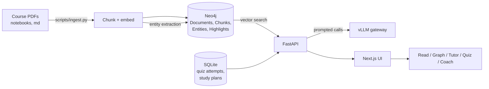

# rianru

*เรียนรู้ — "to learn."*

A local, single-user study tool that turns a semester of course PDFs and Jupyter
notebooks into something you can question, map, practise against, and be coached
through. Everything runs on your own machine: the material never leaves it, and
the only outside call is to an LLM endpoint you control.

Built against one text-analytics course, but the ingest step takes a course code,
so it works on any course whose files you list in a manifest.

## What it does

- **Read.** Renders lecture PDFs with a real text layer. Select any passage and
  get an explanation grounded in the surrounding chunk of the actual slide, not
  in the model's general knowledge. Notebooks render markdown and code cells
  with syntax highlighting.
- **Highlight.** Save an explanation as a `Highlight` node linked to the chunk it
  came from and to any course concepts it mentions. Highlights survive
  re-ingesting the document they came from.
- **Map.** A force-directed knowledge graph of the documents, the concepts
  extracted from them, and your own highlights. Filter by topic, click a node to
  see where it came from.
- **Ask.** A tutor that answers from retrieved course chunks (RAG over a Neo4j
  vector index) and cites the document and page it used.
- **Practise.** Generates multiple-choice and short-answer questions from a
  topic's own chunks. Answers are graded server-side against the stored answer —
  the browser cannot assert its own correctness.
- **Be coached.** A LangChain multi-agent coach reads your recorded quiz history
  and your material, then produces concrete tasks: what to study, which document
  and page covers it, and why it picked that. Tasks can be ticked off and
  persist.

## How it works



Two stores, on purpose. Neo4j is the single source of truth for the course
material — documents, chunks, extracted concepts, highlights, generated
questions, plus the vector index used for retrieval. Personal progress (quiz
attempts, scores, study plans) is tabular time-series data and lives in a local
SQLite file, so your history never mixes into the course graph.

The coach is a supervisor agent whose two tools are themselves agents: a
progress agent over the SQLite history and a material agent over the course
text. That structure is deliberate rather than incidental — see
[`docs/intent/study-coach-agents.md`](docs/intent/study-coach-agents.md).

Ingestion is a CLI, never a web request, so a long run cannot time out a live
endpoint. The LLM key stays server-side; the browser never sees it.

## Requirements

- Docker (for Neo4j 5.15)
- Python 3.11+
- Node.js 20+
- An OpenAI-compatible chat completions endpoint (a vLLM gateway, or anything
  that speaks the same API)

A GPU is optional. Embeddings run on CPU by default; with an NVIDIA card,
install a matching CUDA build of torch and `sentence-transformers` picks it up
on its own — see the note in `server/requirements.txt`.

## Setup

**1. Clone and configure**

```bash
git clone https://github.com/EarthWittawat/rianru.git
cd rianru
cp .env.example .env      # then fill in the values
```

`.env` lives at the repo root and is read by the backend:

| Variable | What it is |
|---|---|
| `VLLM_URL` | Base URL of the chat completions API, e.g. `https://host/v1` |
| `VLLM_MODEL` | Model name the gateway serves |
| `VLLM_API_KEY` | Key for that gateway |
| `NEO4J_URI` | `bolt://localhost:7687` |
| `NEO4J_USER` | `neo4j` |
| `NEO4J_PASSWORD` | Password for the local database — required, no default |

**2. Start Neo4j**

```bash
docker compose up -d neo4j
```

Ports are bound to `127.0.0.1` only. The browser UI is at
<http://localhost:7474>.

**3. Backend**

```bash
cd server
python -m venv .venv
.venv/Scripts/activate            # Windows;  source .venv/bin/activate elsewhere
pip install -r requirements.txt
uvicorn app.main:app --reload --port 8000
```

`GET /health` returns `{"neo4j": "ok"}` once the database is reachable.

**4. Frontend**

```bash
cd web
npm install
npm run dev
```

Runs on <http://localhost:3000>, or the next free port if that one is taken.
The backend accepts any localhost origin, so a fallback port still works.

**5. Point it at your course material**

Put your course folders anywhere under the repo root and describe them in
`manifest.json`. That file is deliberately not committed — it lists your own
enrolled classes and assignments — so you create it yourself:

```json
{
  "root": "/absolute/path/to/repo",
  "classes": {
    "class-1": {
      "code": "ABC123",
      "name": "Example Course Name",
      "folder": "ABC123 - Example Course",
      "assessment_activities": {
        "lab-1": {
          "title": "Lab 1: Example Lab",
          "type": "activity",
          "folder": "Assessment Activity/Lab 1",
          "files": ["lab1.ipynb", "description.md"]
        }
      },
      "learning_activities": {
        "lecture-1": {
          "title": "Example Lecture Topic",
          "type": "material",
          "folder": "Learning Activity/L1",
          "files": ["L1 - Slides.pdf"]
        }
      }
    }
  }
}
```

The keys under `classes`, `assessment_activities` and `learning_activities` are
arbitrary — any unique string works, so use whatever your source system gives
you or make them up. Each activity's `title` becomes the topic used for
quizzes, graph filtering and coaching. Files are read from `<folder of class>/<folder of activity>/<file>`.
`.pdf`, `.ipynb` and `.md` are ingested; anything else in `files` is skipped.

**6. Ingest**

```bash
cd server
python scripts/ingest.py --class ABC123
```

This parses and chunks every listed file, embeds each chunk, writes
`Document`/`Chunk` nodes plus the vector index, then extracts concepts and
relations chunk by chunk via the LLM. It prints a per-file result and a summary.
As a scale reference, a 19-file course produced 504 chunks and 715 distinct
concepts.

Useful flags:

| Flag | Effect |
|---|---|
| `--skip-entities` | Chunk and embed only. Much faster; the graph gets documents but no concepts |
| `--workers N` | Parallel extraction calls, default 3. Raise only if your gateway allows more concurrency |

Re-running is safe: a document's chunks are replaced, and saved highlights are
re-attached rather than orphaned.

## Using it

| Page | What it is for |
|---|---|
| `/viewer` | Pick a document, read it, select text to explain, save highlights |
| `/graph` | The knowledge graph, filterable by topic |
| `/chat` | Ask a question, get an answer cited to document and page |
| `/quiz` | Generate questions for a topic; every answer is recorded |
| `/coach` | Generate a study plan from your recorded results |

The coach only has something to say once you have answered some quiz questions —
that history is the signal it reasons over. With no attempts recorded it will
say so rather than invent a weakness.

## Development

```bash
# Backend (from server/)
pytest                          # full suite
pytest -m "not slow"            # skip tests that call the LLM gateway
ruff check .

# Frontend (from web/)
npm test
npm run lint
npm run build
```

Current state: 85 backend tests (2 marked slow), 21 frontend tests.

## Project layout

```
docker-compose.yml       Neo4j service, bound to loopback
manifest.json            Your course index — local only, not committed
docs/
  SPEC-learning-tool.md  The specification this was built against
  intent/                Confirmed intent behind each milestone
tasks/                   Task lists and what each one delivered
server/
  app/
    routers/             HTTP surface, one file per feature
    services/            Chunking, embeddings, Neo4j, SQLite, LLM client
    agents/              LangChain coach, specialist agents, tool layer
  scripts/ingest.py      The ingestion CLI
web/
  app/                   Next.js App Router pages
  components/            Viewer, graph, chat, quiz, study plan
```

## Known limitations

- **Retrieval is text-only.** Figures, tables and slide layout are not
  searchable. Multi-vector retrieval over page images (ColPali/ColQwen) was
  considered and deferred.
- **Plan generation is slow.** The coach is an agent whose tools are agents, so
  one plan is many sequential model round trips. A cold run has taken over ten
  minutes on a reasoning model. There is no step cap or timeout on the loop yet.
- **Some notebook code cells yield no concepts.** The model occasionally answers
  conversationally instead of returning JSON for those; the chunk is still
  searchable, it just adds nothing to the graph.
- **Highlights anchor on chunk index.** If a source file itself changes, a
  restored highlight can land on a shifted chunk.
- Single user, no auth, localhost only. Nothing here is hardened for a shared
  deployment.

## Notes

Course material is read-only input and is never committed — the course folders,
`manifest.json`, `.env` and the local progress database are all gitignored.
test
